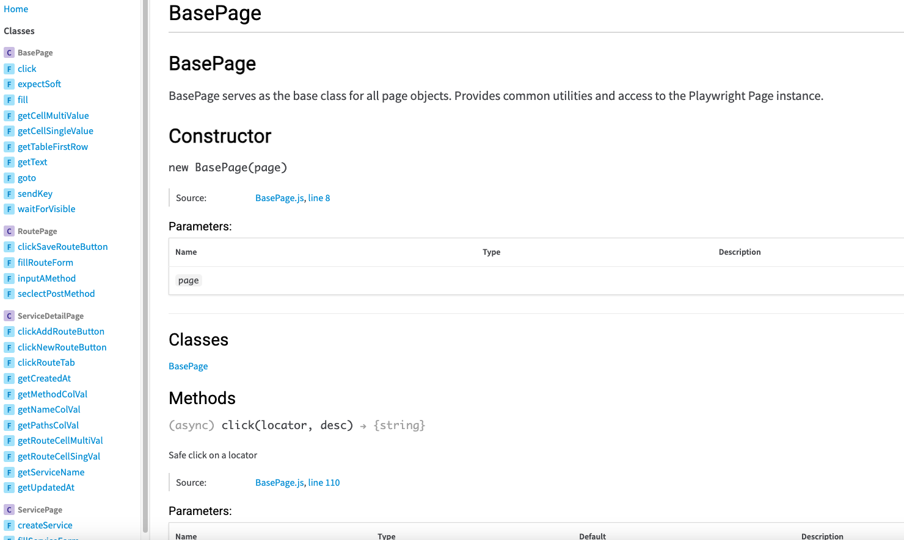
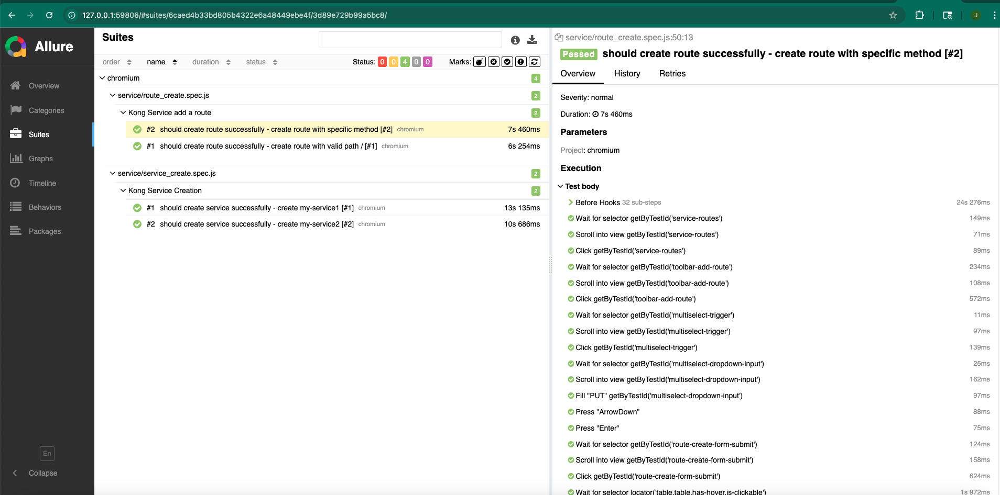

#  Automation Test Framework

This is a **Playwright (JavaScript) based automation framework** for testing web UI.  
It supports **data-driven testing**, **soft assertions**, **logging**, **screenshot on failure**, **API operations** and CI/CD integration.

---

## 📦 Features

- Automated creation of Kong **Services** and **Routes**  
- **Data-driven testing** with dynamic placeholders (`${uuid()}`, `${date()}`)
- **Page Object Model (POM)** for stable and reusable UI operations
- Soft assertions to continue test execution even when some checks fail  
- Detailed logging of each step  
- **API operations** for fast setup/cleanup (e.g., deleting Services)
- Configurable environments via `.env` + `playwright.config.js`
- Screenshot capture on test failure  
- Integration with **GitHub Actions** CI/CD  
- Allure test report

---

## 🛠️ Project Structure

playwright-demo/

├─ allure-results/       # test report with allure format

├─ docs/                   # function document for each page

├─ logs/                     # logs for debugging

 ├─ tests/
 
 │  ├─ service/                  # Service related test cases
 
 │  └─ data/                     # Test data JSON files
 
 ├─ pages/                       # Page object classes
 
 ├─ utils/                       # Logger, global config, helper functions
 
 ├─ playwright.config.js          # Playwright configuration

├─ .env       # config test environment

 └─ package.json

1. **Install dependencies**
```bash
npm install
```


2.**Run tests**

```
npx playwright test
```

3.**Run a single test file**

```
npx playwright test tests/service/service_create.spec.js
```

4.**Generate Allure report**

```
npm run test:allure
```


## 📂 Test Data

- Test data is stored in `tests/data/serviceData.json`

- Supports **dynamic placeholders**:

  - `${uuid()}` → generates a random UUID
  - `${date()}` → generates current date/time

- Example:

  {
    "validCases": [
      {
        "name": "my-service-${uuid()}",
        "url": "http://example.com"
      }
    ]
  }

## 🧩 Usage

- **Creating a Service**

  const sp = new ServicePage(page);
  await sp.goto();
  await sp.createService(data.validCases[0]);

## ⚙️ Configuration

- `utils/globalConfig.js` contains global variables, e.g.:

```
export const config = {
  baseUrl: process.env.BASE_URL,
  env: process.env.ENV || 'test',
 
};
```

- The `playwright.config.js` file contains global test settings:
  - **Base URLs** for your application (`baseURL`)
  - **Browser settings** (headless, viewport size, device emulation)
  - **Retries** for failed tests
  - **Reporters** and screenshot/video capture
    
## 🎯 CI/CD Integration

- GitHub Actions workflow can be used to run the tests on push or pull request.
- Allure reports and screenshots can be collected in CI.
- 
## 💡 Design Considerations

- **Page Object Model (POM)**: Encapsulates page elements and actions for reusability and maintainability
- **Soft Assertions**: Allows tests to continue even when some checks fail, useful for UI validation
- **Data-driven Testing**: Test data separated into JSON, supports dynamic placeholders
- **API Operations**: For setup/cleanup (e.g., deleting services) to reduce UI dependency
- **Fault Tolerance**: Wrapped operations like `safeClick`, `safeFill`, `safeGetText` to handle missing elements or DOM changes
- **Environment Configuration**: `.env` + `playwright.config.js` allows flexible environment switching (local, staging, CI)
- **Docs**: Providing Page Object methods  to make it easy for new developers or testers to understand and extend.
- 
- **Allure Reports**: Integrated Allure report generation for detailed, visually rich test reports.
- 

## ⚖️ Trade-offs

- **UI vs API**:
  - UI operations can be unstable due to network or rendering → handled with waits and fault tolerance
  - API operations are faster and more reliable → used for cleanup/setup
- **Hard-coded URLs vs Dynamic Environment**:
  - `playwright.config.js` provides defaults for rapid testing
  - `.env` allows environment switching without code changes
- **Test Coupling vs Independence**:
  - Some tests depend on previously created services → shared variables or pre-API setup
  - Tests are designed to be mostly independent for maintainability
